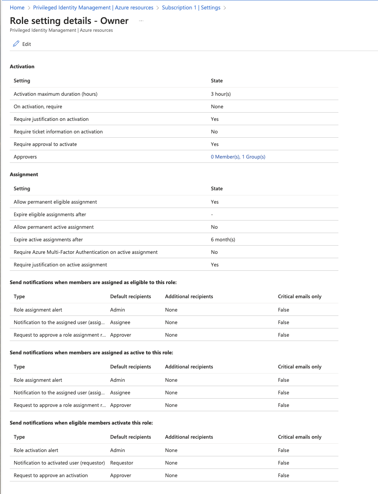

# AD PIM IaC Demo

This repository contains demo IaC (Infrastructure as Code) for Azure AD Privileged Identity Management. The terraform support for Azure resources PIM settings such as `Approvers` and `Activation maximum duration (hours)` is currently non-existing. There are ongoing issues tracking the implementation.

This repository contains a powershell script that uses the `Az.Resources` module to update the PIM settings for a role assignment.
 

 - Updates ExpirationRule to `Never`
 - Updates Approvers to a spesific Azure AD group
 - Updates Activation maximum duration (hours) to `3`

## Requirements

- Microsoft Entra Identity Protection Plan 2 (P2)

## PIM for Azure Resources

PIM for Azure Resources is a service in Azure that enables you to manage, control, and monitor just-in-time Azure resources access within your organization.

## Powershell

- [Install powershell](https://learn.microsoft.com/en-us/powershell/scripting/install/installing-powershell?view=powershell-7.4).
- Go into powershell mode.

```
pwsh
```

- Install Az.Resources module

```
Install-Module -Name Az -AllowClobber -Scope CurrentUser
```

- Login using

```
Connect-AzAccount
```

- Run the script

```
update-role-management-policy.ps1
```

## Lessons Learned

- The [terraform documentation](https://registry.terraform.io/providers/hashicorp/azurerm/latest/docs/resources/pim_eligible_role_assignment#schedule) states the `ExpirationRule` is optional. However, not setting it results in the error:

```
Unexpected status 400 with error: RoleAssignmentRequestPolicyValidationFailed: The following policy rules failed: ["ExpirationRule"]
```

- It is not possible to set the PIM role assignment expiration duration to `not expire` without chainging the `RoleManagementPolicyExpirationRule` first.
- Updating or creating new `IRoleManagementPolicyRules` requires full namespace on, e.g., `Microsoft.Azure.PowerShell.Cmdlets.Resources.Authorization.Models.Api20201001Preview.RoleManagementPolicyApprovalRule`. The same applies to `ruleType`.
- Adding `-Debug` to the `New-AzRoleManagementPolicyRule` cmdlet provides more information on the error, including the JSON payload.
